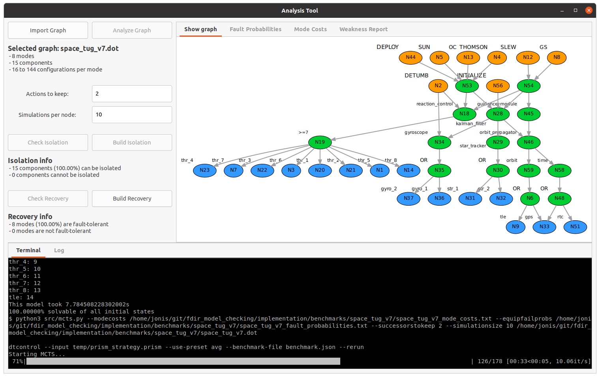

# build_and_improve_fdir
Utilize the model checker PRISM for generating fault isolation and recovery controllers



## Getting started
clone the repository, navigate to its root and execute the install script:
```
./install.sh
```

## Use the GUI
launch the gui via the virtual environment that install.sh created:
```
source python3.9-venv/bin/activate
python3 src/analysis_tool_gui.py
```

## Contact
if you have comments, found a bug, or have a suggestion for improvement, feel free to contact us via mail: j.kiesbye@tum.de

## Credits
the authors of this tool are Kush Grover and Jonis Kiesbye,
the software is released under MIT license.
